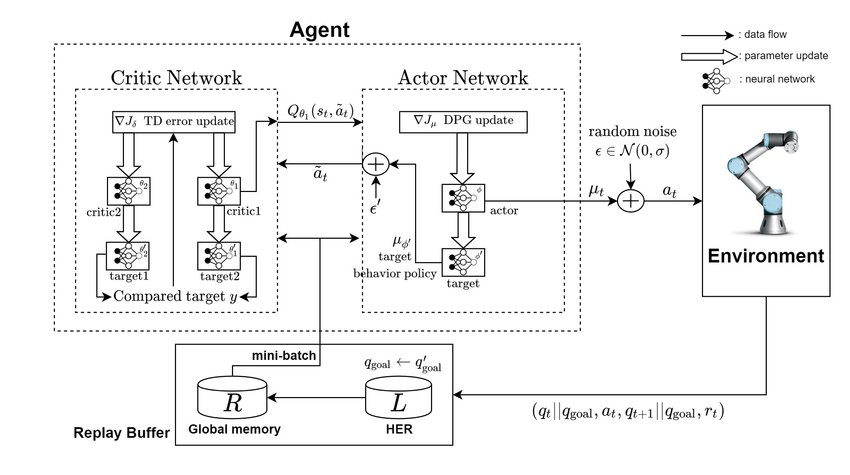
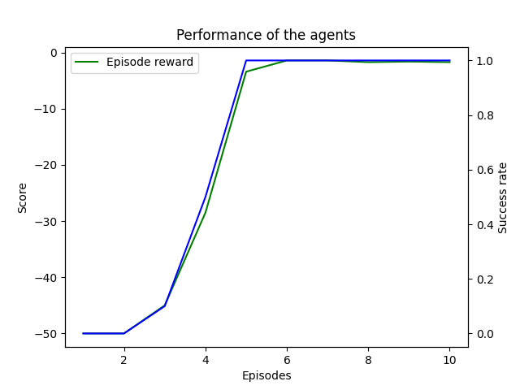
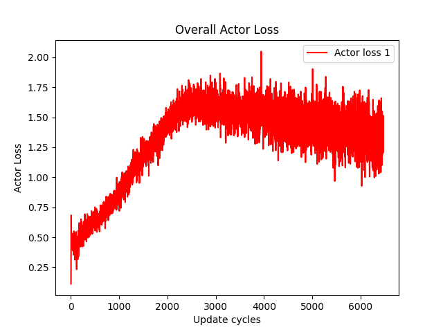
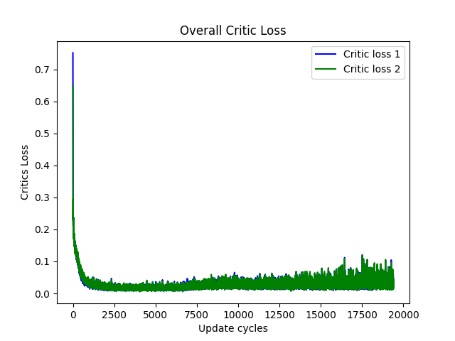

# Twin Delayed Deep Deterministic Policy Gradient with HER memory (TD3-HER)

## Panda Gym environment for sparse reward
This repository is an example of Twin Delayed Deep Deterministic Policy Gradient architecture with hindsight experience replay memory. This implementation is fine-tuned for environment: **PandaReach-v3**.  

## The environment - PandaReach
The environment is a 2D grid world with 1 agents and 1 landmark. The agent is panda robot and the landmark is a ball. The goal of the agent is to reach the landmark. The agent receives a reward of +1 for reaching the landmark and a reward of -1 for each time step.  
The environment is desigend to provide sparse rewards, therefore the agent must use HER memory to efficiently learn to reach the landmark.  
More about the environment: https://panda-gym.readthedocs.io/en/latest/usage/environments.html  

## Twin Delayed Deep Deterministic Policy Gradient (TD3)
TD3 is a variant of the reinforcement learning algorithm DDPG (Deep Deterministic Policy Gradient). TD3 was introduced as a way to improve the stability and robustness of the original DDPG algorithm. Like DDPG, TD3 is a model-free, off-policy algorithm that is well-suited for continuous action spaces. It uses deep neural networks to learn a policy (i.e., a mapping from states to actions) that maximizes the expected reward in an environment. 
The main idea behind TD3 is to use two separate networks for the actor and the critic, instead of just one like in DDPG. The two critic networks are trained to estimate the value function, while the actor network is trained to select actions. 
In addition, TD3 uses a clipped double-Q learning update rule for the critics, which helps to prevent over-estimation of the value function. This is achieved by taking the minimum of the two critic estimates and using this to update the policy, rather than using the maximum estimate like in DDPG.  
More about the TD3 algorithm: https://arxiv.org/pdf/1802.09477.pdf 

## Hindsight Experience Replay (HER)
Hindsight Experience Replay (HER) is a method for learning from sparse, delayed, and hard-to-interpret rewards. HER is a memory replay technique that can be used with any model-free RL algorithm. It works by storing trajectories that deviate from the goal, and then replaying them with the goal substituted by the achieved goal. This allows the agent to learn from suboptimal actions, and can be used to learn from sparse rewards.  
More about the HER algorithm: https://arxiv.org/pdf/1707.01495.pdf  

## Network architecture
 
(Source: https://www.researchgate.net/figure/Structure-of-TD3-Twin-Delayed-Deep-Deterministic-Policy-Gradient-with-RAMDP_fig2_338605159) 

## Results and benchmarks
The network was trained for 10 epochs, and the results are shown below.  
 
 
 

## Notable Hyperparameter
- Epoch training: 10
- Number of Cycles per epoch: 50
- Number of steps per cycle: 16
- Optimization steps per cycle:40
- Number of Evaluation Episodes: 10
- Batch size: 256
- Learning rate (Actor): 0.001
- Learning rate (Critic): 0.0005
- Discount factor (Gamma): 0.99
- Weight transfer (Tau): 0.001
- Weight/Bias initialization: He Normal
- Delay steps of Actor Training: 3
- Memory Size: 10**6
- HER strategy: future
- HER proportion: 4 (4 times more HER transitions than regular transitions)
- Noise: Ornstein-Uhlenbeck process

I used Leaky RELU activation functions for hidden layers with Tanh activation function for the output layer of the Actor network. The Critic network uses Leaky RELU activation functions for hidden layers with no activation function for the output layer.  

## Prerequisites
* gymnasium
* panda-gym 
* Numpy
* Tensorflow
* Matplotlib

This network was trained in docker container with the mcr.microsoft.com/devcontainers/python:0-3.10 image.   
 

## Links to research papers and other repositories
TD3 algorithm: https://arxiv.org/pdf/1802.09477.pdf  
HER algorithm: https://arxiv.org/pdf/1707.01495.pdf  
